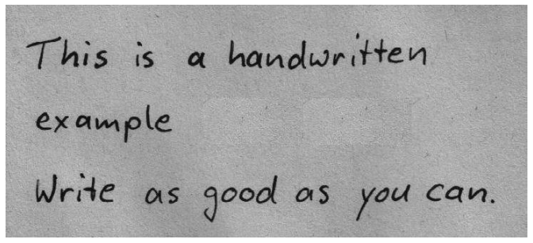
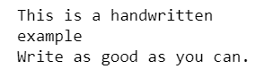
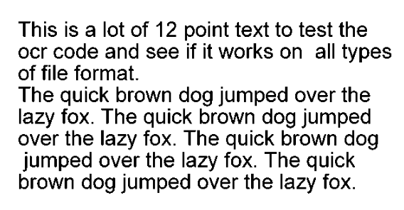
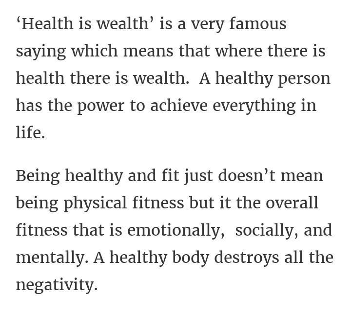
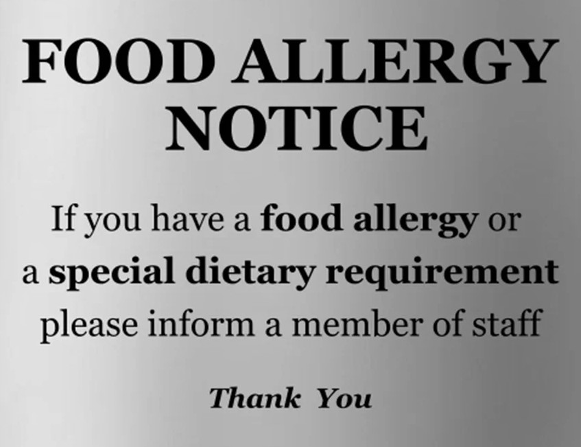
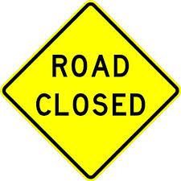
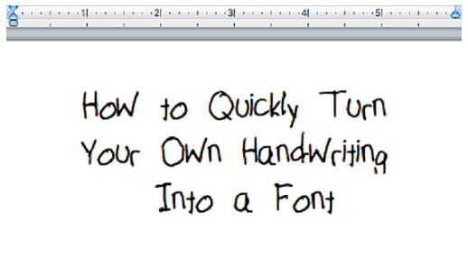
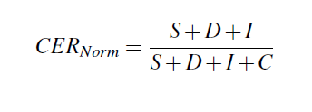
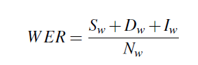

# Vision For Vision - Image to Speech Translation

#### Erik Pheng Kong Chang, Isha Padmanaban, Lakshmi Muraleedharan Nair

## The Problem

The problem we are trying to solve is providing access to digital images for the visually impaired. In 2015, there was an estimated 253 million people world wide who are visually impaired. This means that many of them have limited access to the digital world as most of it is reliant on sight. One way that visually impaired people navigate the internet is through text to speech applications. However, this method does have its limitations because these simple text to speech solutions cannot read the text from images.

This problem is <strong>important</strong> because it allows visually challenged people to get a deeper enjoyment and utilization of the internet and perhaps help them navigate the outside world. Ultimately, this all allows them to be more autonomous in the real world and online.

## Literature Review
### Image Pre-processing

Low resolution, low contrast, high noise, and distortions are some challenges faced while retrieving text from images. The input images should be enhanced to obtain the exact text. One way of achieving this is by using computer vision OpenCV and Python libraries for Image Processing. Karun et. al. [3] explored the idea of extracting text from an image in a dynamic low light environment after eliminating noise. After capturing the input image, Fujii et al. [4] converted it to a gray scale image and then applied the required filtering with the help of Gaussian filter to reduce noise. We are incorporating image pre-processing steps such as thresholding and noise removal in our project to get accurate text from the image.

### Image to Text

Qi Zheng used segmentation algorithm to recognise characters with the help of multiple-size sliding sub-windows. After getting template images first, the SIFT features are extracted and matched with that of the template images. With this, multiple single-character-areas are found and are validated using a voting and geometric verification algorithm [7]. Text is extracted from images currently using OpenCV OCR. This OCR utilizes a deep learning model for text recognition that is highly accurate. But it requires the images to be captured in certain angles which is not ideal in real world. We are using Tesseract OCR for text extraction as it works effectively on different kinds of recognition such as images with words, text blocks and vertical text.

### Text to Speech

Yuxuan et al. [5] proposed a text-to-speech (TTS) model named Tacotron that is end-to-end and is capable of generating speech directly from characters. When text and its corresponding audio are given, the TTS model is trained completely from scratch to convert a new text file to audio. We are using open source TTS solution by Mozilla in our project for text-to-speech translation.

## Proposed Solution

 The solution to our proposed problem requires three main steps - Image Pre-processing, Image to Text with OCR, Text to Speech synthesis.

### Step 1: Image Pre-processing

Below are the important pre-processing techniques we applied on the input image to enhance the quality of the image and extract the right text. We are using the OpenCV python package for this purpose. This step will greatly improve user experience and eliminate some of the current limitations of the OCR systems.

<ul>
  <li><strong>Grayscale Conversion : </strong>We are using OpenCV cvtColor function to convert the colored image to grayscale image.</li>
  <li><strong>Threshold and Binarization : </strong>This step converts the grayscale image into a binary image with only black and white color. This is done so that Tesseract OCR can identify text easily.</li> <!-- For every pixel, the same threshold value is applied. If the pixel value is smaller than the threshold, it is set to 0, otherwise it is set to a maximum value. -->
  <li><strong>Noise Removal : </strong>We used openCV erode and dilate method to remove small white noises and increase the object area of the input image. We applied median blur filtering technique to preserve the edges of image while removing noise.</li>
</ul>

### Step 2: Image to Text

We used open source Tesseract Optical Character Recognition engine for obtaining text from images [6]. This library is proven to provide better quality output. We provided the required configuration settings in a Python program to read through categories such as texts, numbers and special characters from images and output them with acceptable level of accuracy. This needed trial and error effort to find the right configuration for each of the categories. We have tested the code with rich set of images including images with short words, magazines, and handwritten notes to validate the correctness of the module.

### Step 3: Text to Speech

In this final step, the resulting text is sent to the text-to-speech solution. We used an open source TTS solution by Coqui, which is derived from the Mozilla TTS solution. This TTS solution is made up of three components, the TTS model itself, the dataset used, and the vocoder model. We used the pretrained TTS model known as Tacotron2 with Dynamic Convolutional Attention (Tacotron2 DCA). We then used the LJSpeech dataset, which is a public domain english speech dataset and for the vocoder model we chose the Multi-Band MelGAN because it was the fastest model.

## Results

<table border="5" bordercolor="black" align="center">
    <tr>
        <th>Input Image</th>
        <th>OCR output</th>
        <th>TTS output</th>
        <th>Comments</th>
    </tr>
    <tr>
        <td></td>
        <td>This is a handwritten example Write as qooal as you can.</td>
        <td>
          <audio controls> 
            <source src="handwritten1_preprocess.mp4" type="audio/mp4">
          </audio>
        </td>
        <td>Handwritten text. Image  pre-processing is not done.  Tesseract ouput is not accurate.</td>
    </tr>
    <tr>
        <td></td>
        <td>This is a handwritten  example  Write as good as you can.</td>
        <td>
          <audio controls> 
            <source src="handwritten1_preprocess_res.mp4" type="audio/mp4">
          </audio>
        </td>
        <td>Handwritten text. Proposed  image pre-processing is applied.  Tesseract ouput is accurate.  Shows the importance of our  pre-processing techniques</td>
    </tr>
    <tr>
        <td></td>
        <td>This is a lot of 12 point text to test the 
          ocr code and see if it works on all types 
          of file format. The quick brown dog jumped over the 
          lazy fox. The quick brown dog jumped 
          over the lazy fox. The quick brown dog 
          jumped over the lazy fox. The quick 
          brown dog jumped over the lazy fox.</td>
        <td>
	  <audio controls>
            <source src="print_preprocess.mp4" type="audio/mp4">
          </audio>
        </td>
        <td>Printed text</td>
    </tr>
    <tr>
        <td></td>
        <td>‘Health is wealth’ is a very famous 
        saying which means that where there is 
        health there is wealth. A healthy person 
        has the power to achieve everything in 
        life. 
        Being healthy and fit just doesn’t mean 
        being physical fitness but it the overall 
        fitness that is emotionally, socially, and 
        mentally. A healthy body destroys all the 
        negativity.</td>
	<td>
	 <audio controls>
            <source src="para.mp4" type="audio/mp4">
          </audio>
        </td>
        <td>Articles</td>
    </tr>
    <tr>
        <td></td>
        <td>FOOD ALLERGY NOTICE 
        If you have a food allergy or 
        a special dietary requirement 
        please inform a member of st 
        Thank You</td>
	<td>
         <audio controls>
            <source src="menu.mp4" type="audio/mp4">
          </audio>
        </td>
        <td>Real world signs</td>
    </tr>
    <tr>
        <td></td>
        <td>ROAD CLOSED</td>
	<td>
         <audio controls>
            <source src="sign.mp4" type="audio/mp4">
          </audio>
        </td>
        <td>Real world signs</td>
    </tr>
    <tr>
        <td></td>
        <td>How jo Quickly Turn Your Own Handwriting Into a Font</td>
	<td>
         <audio controls>
            <source src="handwritten2_preprocess.mp4" type="audio/mp4">
          </audio>
        </td>
        <td>Handwritten texts</td>
    </tr>
</table>

## Evaluation

We evaluated the accuracy of text retrieved from image using recognition rate, and error rate. Our OCR model performance is evaluated by calculating Normalized Character Error Rate (CERNorm) and Word Error Rate (WER). These metrics show the extent to which our OCR module transcribed text and how the ground truth text differ from each other. CER and WER represent the number of character/word substitutions or deletions, or insertions needed to transform one word/sentence into another respectively. Both of these quantitative metric systems are based on the Levenshtein distance. 

 

 
  
We have considered a dataset of 200 images containing English letters in .jpg format with their equivalent text saved in .txt files to evaluate our solution. The dataset also contains difficult images, like images with high noise or blurriness. As we evaluated our solution over the dataset, we obtained a Normalized Character Error Rate 
score of 6.17. Our solution achieved an accuracy of around 88.33% in terms of letter recognition rate over the testing dataset.

## References
<ol>
  <li><a href="https://github.com/coqui-ai/TTS">https://github.com/coqui-ai/TTS</a></li>
  <li>Ackland P, Resnikoff S, Bourne R. World blindness and visual impairment: despite many successes, the problem is growing. <em>Community Eye Health</em>, 2017.</li>
  <li>Karun Somasunder M, Amal J.S, Gopal Gopakumar, Suraj V Thomas, and Keerthi Krishnan. Text to speech conversion using google vision api. National Conference on Smart Systems and Technologies, 2021.</li>
  <li>Yasuhisa Fujii. Optical character recognition research at google. IEEE 7th Global Conference on Consumer Electronics (GCCE), 2018.</li>
  <li>Yuxuan Wang, RJ Skerry-Ryan, Daisy Stanton, Yonghui Wu, Ron J. Weiss, Navdeep Jaitly, Zongheng Yang, Ying Xiao, Zhifeng Chen, Samy Bengio†, Quoc Le, Yannis Agiomyrgiannakis, Rob Clark, and Rif A. Saurous. Tacotron: a fully end-toend text-to-speech synthesis model. arXiv preprint arXiv:1703.10135, 2017.</li>
  <li><a href="https://github.com/tesseract-ocr/tesseract">https://github.com/tesseract-ocr/tesseract</a></li>
  <li>Jian Zhang, Renhong Cheng, Kai Wang, Hong Zhao, “Research on the text detection and extration from complex images”, Fourth International Conference on Emerging Intelligent Data and Web Technologies. Vol. 10, 2013, Page no. 708-713.</li>
</ol>
